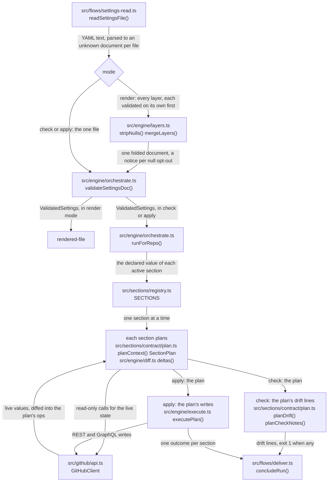
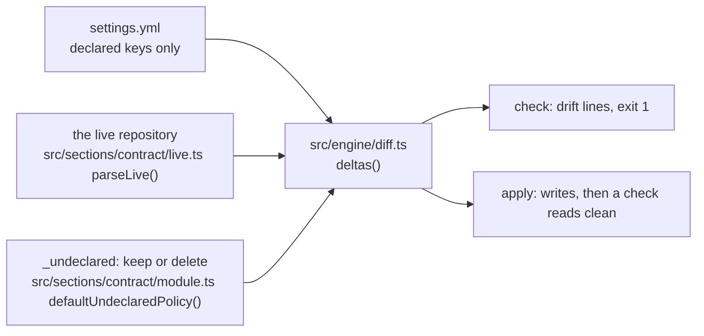
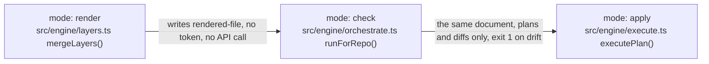
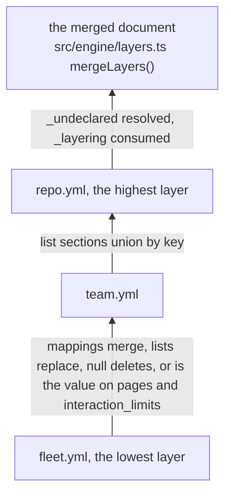
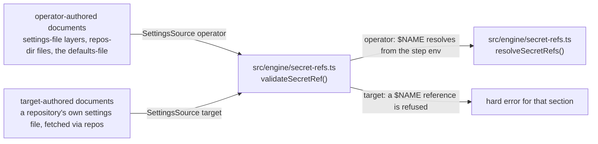
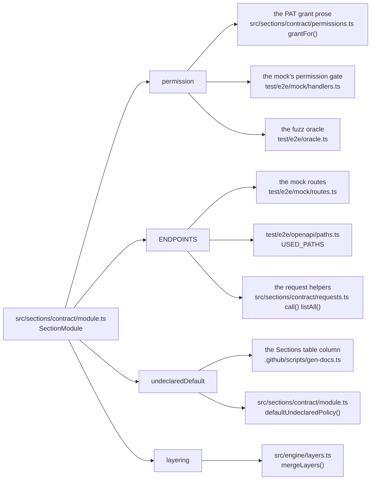
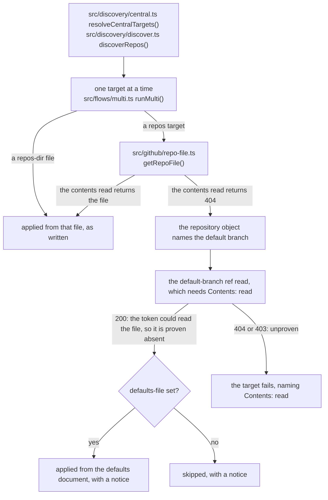
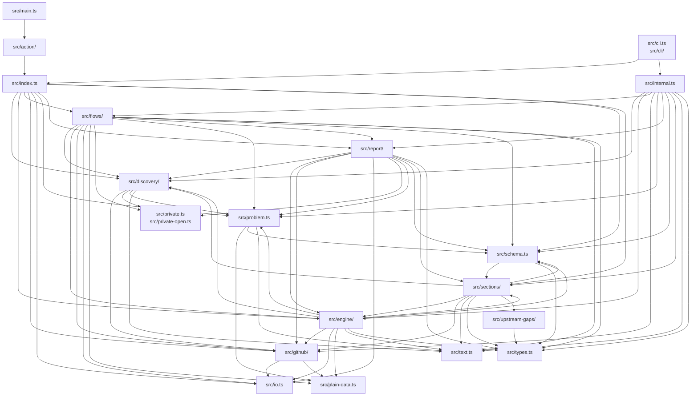

# Architecture

How the action works, one diagram at a time. Every box that names a file in this repository lists the symbols it exports, and a test checks that each one exists. Under each concept diagram, a "Demonstrated by" line links the test or scenario that covers it.

The check is existence only: a caption-only box (`mode`, `rendered-file`) names no file and is not checked, and a demonstration link is checked to resolve, not to test the claim above it.

The [module map](#the-module-map) at the end is generated from [architecture.yml](https://github.com/Vivswan/github-settings-as-code/blob/main/architecture.yml). The `lint:arch` script keeps that declaration equal to the import graph, so the map cannot show an edge the code does not draw.

It also enforces the never-throw rule: errors are values, a neverthrow `Result` carrying a typed `Problem`. A `throw` is allowed only as a `BUG:` invariant, a bare rethrow directly in its `catch`, or in a file the `throws` block of architecture.yml names.

That block counts the remaining throws per file. The lint fails when the block and the tree disagree in either direction; that a count only goes down is the review rule in AGENTS.md.

## The journey of one settings file

- A settings file is YAML text until the reader parses it, and an unknown document until validation brands it.
- `mode: render` is the only path through the fold: every layer is validated on its own, folded, validated again, and written to `rendered-file`.
- Check and apply take one file straight to validation, then through each active section module.
- Planning is where the reads happen: a section reads its live state through the client, diffs it against the declaration, and returns a plan of ops, each carrying its drift line.
- Check renders the plan's drift lines and never calls the API again. Apply executes the plan's writes, reading only what a write needs on the way (a public key before sealing a secret).
- The run ends with a summary, outputs, and an exit code.

Demonstrated by: [test/engine/orchestrate.test.ts](https://github.com/Vivswan/github-settings-as-code/blob/main/test/engine/orchestrate.test.ts), [test/e2e/scenarios/apply-idempotent-mixed.yml](https://github.com/Vivswan/github-settings-as-code/blob/main/test/e2e/scenarios/apply-idempotent-mixed.yml).

## The mental model: declare, diff, converge

- You declare, the engine diffs the declaration against the live repository, and apply converges the two.
- A key you do not declare is never compared or touched.
- The one knob on the live axis is `_undeclared`: what happens to a live resource the file does not declare, per list section.
- Re-running an apply rewrites nothing the engine can read back, and a check right after it reads clean. Two writes recur by design because their values cannot be read back: `interaction_limits` re-arms its expiry on every apply, and every declared secret is re-sealed and rewritten on every apply.

Demonstrated by: [test/e2e/scenarios/apply-idempotent-unconditional.yml](https://github.com/Vivswan/github-settings-as-code/blob/main/test/e2e/scenarios/apply-idempotent-unconditional.yml), [src/sections/actions_variables/scenarios/actions-variables-undeclared-keep-note.yml](https://github.com/Vivswan/github-settings-as-code/blob/main/src/sections/actions_variables/scenarios/actions-variables-undeclared-keep-note.yml), [src/sections/actions_secrets/scenarios/actions-secrets-undeclared-delete.yml](https://github.com/Vivswan/github-settings-as-code/blob/main/src/sections/actions_secrets/scenarios/actions-secrets-undeclared-delete.yml).

## The mode ladder

Each rung is safe to run before the next, and moving a file up the ladder changes nothing about the file.

- Render touches only local files.
- Check plans and diffs every active section; nothing executes.
- Apply executes the plan. Under the default `on-missing-permission: fail`, a read-only preflight over the active sections runs first and refuses to write anything when one is denied.

Demonstrated by: [test/engine/check-purity.test.ts](https://github.com/Vivswan/github-settings-as-code/blob/main/test/engine/check-purity.test.ts), [test/engine/layers.test.ts](https://github.com/Vivswan/github-settings-as-code/blob/main/test/engine/layers.test.ts).

## The layering fold as a stack

The stack folds bottom up, one layer per step:

- The higher layer's mappings merge key by key; its scalars and lists replace.
- Its `null` deletes what a lower layer declared, except on `pages` and `interaction_limits`, where `null` is the section's value and is written as such.
- The list sections (`labels`, `rulesets`, every other section with an `_undeclared` knob, and the three plain lists `environments`, `branches`, and `workflows`) union their entries by the section's key instead of replacing; a same-key pair merges field by field under `deep`, is swapped under `shallow`, and the whole list is replaced under `replace`.

The [layering guide](../operate/layering.md) has the full rule table and a worked example.

Demonstrated by: [test/e2e/scenarios/render-union-optout.yml](https://github.com/Vivswan/github-settings-as-code/blob/main/test/e2e/scenarios/render-union-optout.yml), [test/engine/layers.test.ts](https://github.com/Vivswan/github-settings-as-code/blob/main/test/engine/layers.test.ts).

## Trust and provenance

Two kinds of document reach the engine:

- Operator-authored: the settings-file layers, the `repos-dir` files, and the `defaults-file`. They live in the repository that runs the workflow.
- Target-authored: a repository's own `.github/settings.yml`, fetched from the target itself.

A `$NAME` secret reference resolves from the workflow step's environment, so it is honored only in operator documents. A target repository must never be able to route the operator's secrets into itself. Provenance is a property of the source document, decided once where the document is chosen, and every value in it shares that one source.

Demonstrated by: [test/engine/secret-refs.test.ts](https://github.com/Vivswan/github-settings-as-code/blob/main/test/engine/secret-refs.test.ts), [test/engine/secrets.test.ts](https://github.com/Vivswan/github-settings-as-code/blob/main/test/engine/secrets.test.ts), [test/e2e/scenarios/multi-secrets-target-ref-rejected.yml](https://github.com/Vivswan/github-settings-as-code/blob/main/test/e2e/scenarios/multi-secrets-target-ref-rejected.yml).

## The section-module contract

One section declares each fact once and the rest of the system derives from it:

- `permission` drives the grant advice a denial prints, the mock's permission gate, and the fuzz oracle.
- `ENDPOINTS` drives the paths the handlers call, the mock's routes, and the OpenAPI path set.
- `undeclaredDefault` drives the Sections table column and the policy a plain list falls back to.
- `layering` tells the fold how the section's entries union across layers.

Change the declaration and every consumer follows.

Demonstrated by: [test/sections/registry.test.ts](https://github.com/Vivswan/github-settings-as-code/blob/main/test/sections/registry.test.ts), [test/sections/contract.test.ts](https://github.com/Vivswan/github-settings-as-code/blob/main/test/sections/contract.test.ts).

## The multi-repo flow

Targets come from checked-in files under `repos-dir`, from the `repos` list, or from `repos: "*"` discovery. Targets run independently; one failure never stops the rest.

- A target with a settings file, central or remote, is applied from that file alone.
- The `defaults-file` is a fallback: applied whole to a `repos` target proven to have no settings file.
- A contents 404 alone proves nothing (a missing file, a missing grant, or an invisible repository all look the same). The proof is the default-branch ref read, a call that needs Contents: read and succeeds whether or not the file exists: 200 means the token could have read the file, so the file is absent.
- A ref read that is denied leaves the proof inconclusive, and the target fails naming the grant. A denial must never look like a missing file.

Demonstrated by: [test/flows/multi.test.ts](https://github.com/Vivswan/github-settings-as-code/blob/main/test/flows/multi.test.ts), [test/e2e/scenarios/multi-missing-and-failing.yml](https://github.com/Vivswan/github-settings-as-code/blob/main/test/e2e/scenarios/multi-missing-and-failing.yml), [test/e2e/scenarios/multi-contents-denied.yml](https://github.com/Vivswan/github-settings-as-code/blob/main/test/e2e/scenarios/multi-contents-denied.yml).

## The module map

Each node is one layer of `src/`, labelled with the paths it owns; an arrow means the layer imports the other. The map is rendered from `architecture.yml` by `bun run build:docs`, and `bun run lint:arch` fails when the import graph and the declaration disagree in either direction.

<!-- BEGIN GENERATED: architecture-map (bun run build:docs; derived from architecture.yml) -->

<!-- END GENERATED: architecture-map -->

The e2e harness fragments beside each section (`mock.ts`, `generators.ts`) are test code and sit outside the map.
