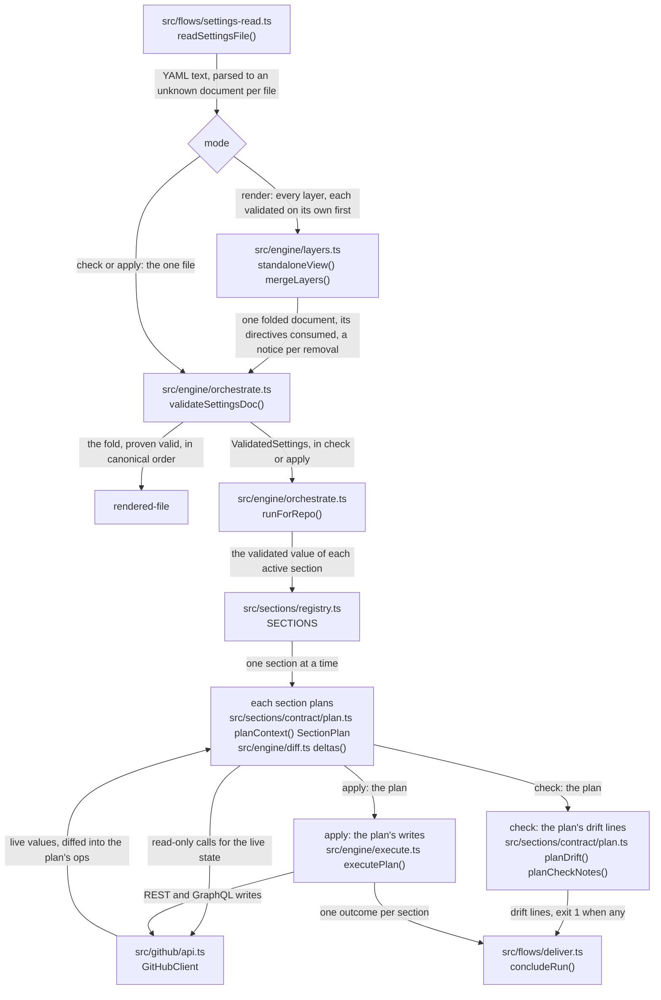
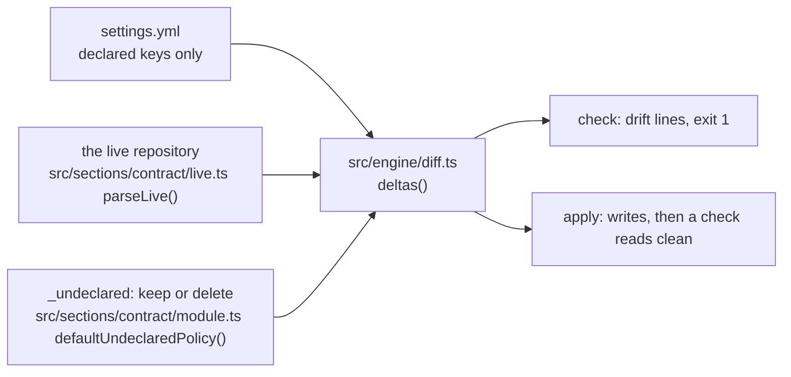
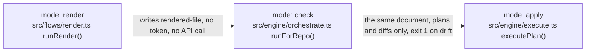
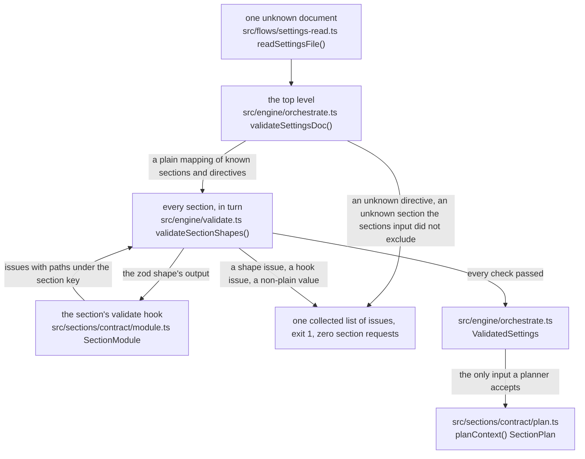
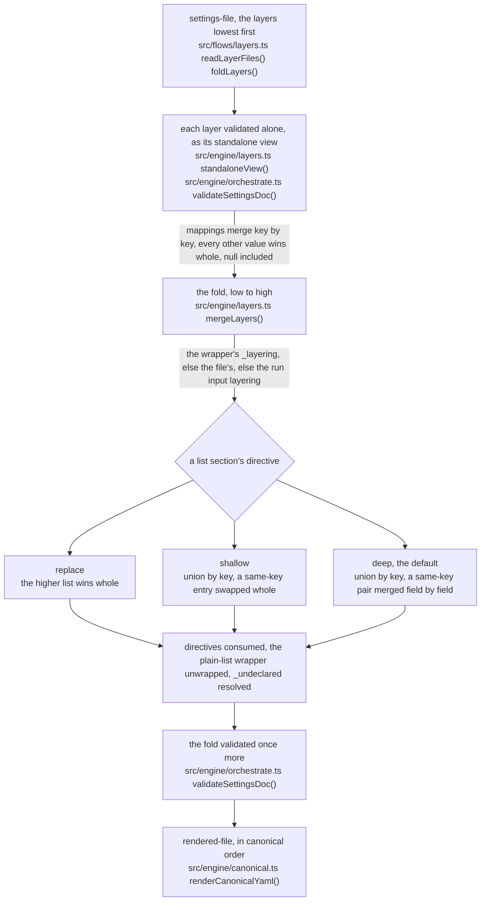
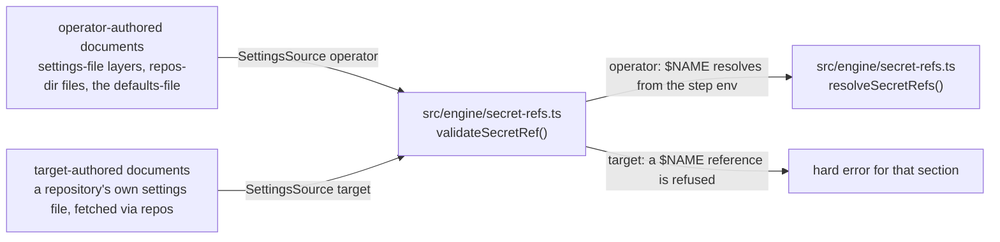
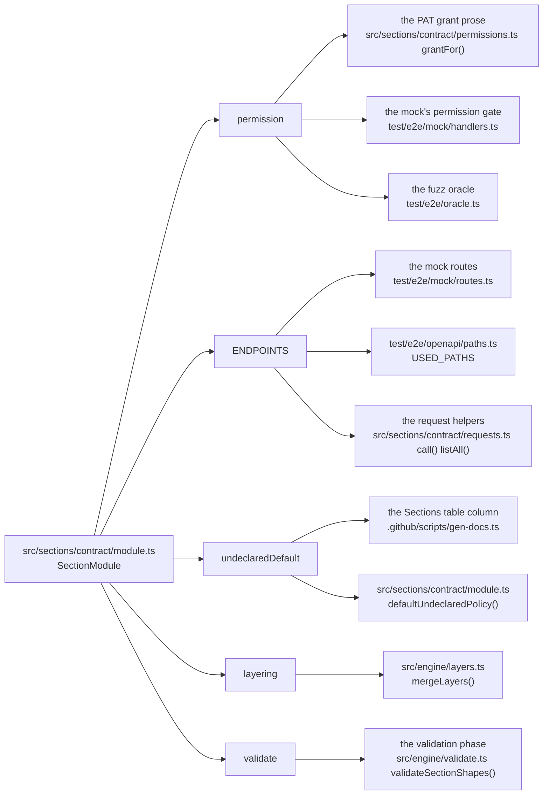
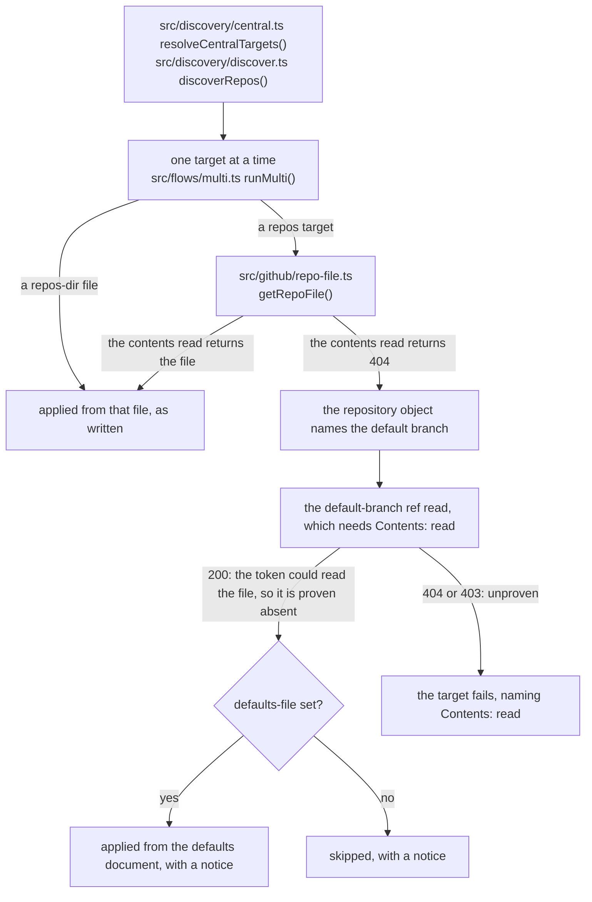
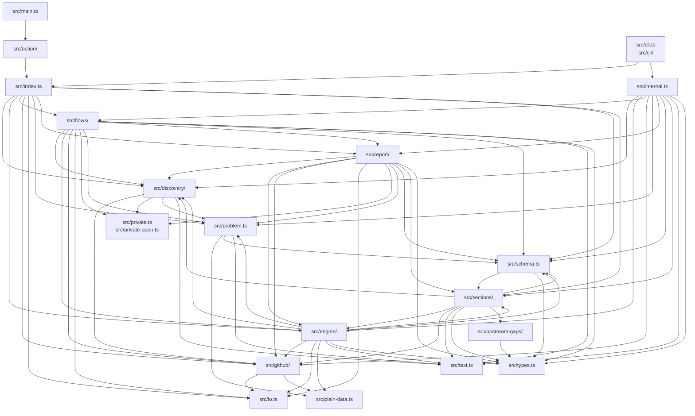

# Architecture

How the action works, one diagram at a time. Every box that names a file in this repository lists the symbols it exports, and a test checks that each one exists. Under each concept diagram, a "Demonstrated by" line links the test or scenario that covers it.

The check is existence only: a caption-only box (`mode`, `rendered-file`) names no file and is not checked, and a demonstration link is checked to resolve, not to test the claim above it.

The [module map](#the-module-map) at the end is generated from [architecture.yml](https://github.com/Vivswan/github-settings-as-code/blob/main/architecture.yml). The `lint:arch` script keeps that declaration equal to the import graph, so the map cannot show an edge the code does not draw.

The same lint enforces the never-throw rule: a function that can fail returns a neverthrow `Result` carrying a typed `Problem`, so an error is a value the caller handles. A section's `plan()`, `snapshot()`, and operation hooks carry a `SectionFailure` instead, which the engine loops match on by kind.

A `throw` is allowed as a `BUG:` invariant, as a bare rethrow inside its own `catch`, or where a third party's contract demands it, in a file the `throws` block of `architecture.yml` names with its reason.

That block counts the remaining throws per file. The lint fails when the count and the tree disagree in either direction, so a converted throw lowers its file's count and the entry leaves the list once no throw remains; that a count only goes down is the review rule in AGENTS.md.

## The journey of one settings file



- A settings file is YAML text until the reader parses it, and an unknown document until validation brands it.
- `mode: render` is the only path through the fold: every layer is validated on its own, folded, validated again, and written to `rendered-file`.
- Check and apply take one file straight to validation, then through each active section module. Every check that reads only the file runs there, before the first request to that repository's sections ([the validation phase](#the-validation-phase)).
- Planning is where the reads happen: a section reads its live state through the client, diffs it against the declaration, and returns a plan of ops, each carrying its drift line.
- Check renders the plan's drift lines and never calls the API again. Apply executes the plan's writes, reading only what a write needs on the way (a public key before sealing a secret).
- The run ends with a summary, outputs, and an exit code.

Demonstrated by: [test/engine/orchestrate.test.ts](https://github.com/Vivswan/github-settings-as-code/blob/main/test/engine/orchestrate.test.ts), [test/e2e/scenarios/apply-idempotent-mixed.yml](https://github.com/Vivswan/github-settings-as-code/blob/main/test/e2e/scenarios/apply-idempotent-mixed.yml).

## The mental model: declare, diff, converge



- You declare, the engine diffs the declaration against the live repository, and apply converges the two.
- A key you do not declare is never compared or touched, except under the three replacing writes ([Semantics](semantics.md) names them).
- The one live-axis knob is `_undeclared`: what happens to a live resource the file does not declare. A knobbed list section's wrapper sets it; a file's top-level `_undeclared` sets it for every knobbed list section of that file, and the run input `undeclared` for every file; the section's default applies where none is set. `environments`, `branches`, and `workflows` apply no policy and refuse the knob ([Undeclared policy](undeclared-policy.md)).
- Re-running an apply rewrites nothing the engine can read back, and a check right after it reads clean. Writes whose value GitHub does not read back recur by design: `interaction_limits` re-arms its expiry, every declared secret is re-sealed, and the Git LFS toggle and `check_suite_preferences` are re-sent on every apply.

Demonstrated by: [test/e2e/scenarios/apply-idempotent-unconditional.yml](https://github.com/Vivswan/github-settings-as-code/blob/main/test/e2e/scenarios/apply-idempotent-unconditional.yml), [src/sections/actions_variables/scenarios/actions-variables-undeclared-keep-note.yml](https://github.com/Vivswan/github-settings-as-code/blob/main/src/sections/actions_variables/scenarios/actions-variables-undeclared-keep-note.yml), [src/sections/actions_secrets/scenarios/actions-secrets-undeclared-delete.yml](https://github.com/Vivswan/github-settings-as-code/blob/main/src/sections/actions_secrets/scenarios/actions-secrets-undeclared-delete.yml).

## The mode ladder



Each rung is safe to run before the next, and moving a file up the ladder changes nothing about the file.

- Render touches only local files.
- Check plans and diffs every active section; nothing executes.
- Apply executes the plan. Under the default `on-missing-permission: fail`, a read-only preflight over the active sections runs first and refuses to write anything when one is denied.

Demonstrated by: [test/engine/check-purity.test.ts](https://github.com/Vivswan/github-settings-as-code/blob/main/test/engine/check-purity.test.ts), [test/flows/render.test.ts](https://github.com/Vivswan/github-settings-as-code/blob/main/test/flows/render.test.ts).

## The validation phase



One rule decides what belongs here: what the settings file alone shows wrong is refused when the file is parsed, naming the key and the fix, never discovered at apply time. A GET-only field, a value outside its enum, a contradictory key pair, two entries naming one label, a secret name GitHub would reject: each is an issue of this phase.

The phase runs in check and apply before the first request to that repository's sections, and in render mode on every layer and on the fold. A layer of the fold is judged as its standalone view, the document minus the directives the fold consumes (`_layering`, the file-wide `_undeclared`, and the `_remove` entries); the fold itself is judged whole.

 In a multi-repo run the `defaults-file` document is validated before target resolution, so an invalid default stops the run before any write; a target's file is validated once fetched, so an earlier target's writes precede a later target's refusal. Three kinds of check take part:

- The zod shape of each section, with its cross-field rules. A rule still runs beside a sibling that failed, so one run reports the bad enum and the contradictory pair together.
- The section's `validate` hook, required on every list section: duplicates by the section's key, a rename that collides, a nested list's own duplicates. Its issues carry paths under the section key, like the shape's.
- Two document-wide walks: a value that is not plain YAML data (a tagged mapping, a list with a hole) and a passthrough number that is not finite.

Every issue the phase finds lands in one list: unknown directives, unknown sections, a single document's `_remove` markers, then each section's issues in apply order. Zero section requests reach that repository, and the run exits 1; in a multi-repo run only that target fails. One downgrade: an unknown section outside a non-empty `sections` allowlist is a warning, so an older action can run a file written for a newer one.

Two limits. A shape's own issues are capped at five per section, with a count of the rest; and a section's hook runs once its shape parsed, so a shape error in an entry can hide a duplicate until it is fixed.

The success path mints the input a planner accepts: a section's `plan()` takes the section's value carrying a type-level brand that names the section it was validated as. A hand-built entry list does not compile. A nullable section's `null` carries no brand: it holds nothing a file-only check could judge.

Secret references are the exception. The `$NAME` syntax is judged per section when the run starts, because the verdict needs the document's provenance ([Trust and provenance](#trust-and-provenance)).

Demonstrated by: [test/engine/validate.test.ts](https://github.com/Vivswan/github-settings-as-code/blob/main/test/engine/validate.test.ts), [test/engine/orchestrate.test.ts](https://github.com/Vivswan/github-settings-as-code/blob/main/test/engine/orchestrate.test.ts), [src/sections/interaction_limits/scenarios/interaction-limits-invalid-values-and-unknown-key-rejected.yml](https://github.com/Vivswan/github-settings-as-code/blob/main/src/sections/interaction_limits/scenarios/interaction-limits-invalid-values-and-unknown-key-rejected.yml).

## The layering fold



The fold is a cascade: the higher layer's value wins at every depth, and `null` is a value. Every list section is keyed by what its planner matches entries by, so a fleet `Bug` and a repository `bug` are one label. Three directives say how a keyed list meets the list below it; here the highest layer, in a run with `layering: replace`:

```yaml layer
_layering: shallow          # every list section of this file, unless it says otherwise
labels:
  _layering: deep           # this section only
  entries:
    - name: bug
      color: d73a4a         # merged field by field into the fleet's bug
    - name: wontfix
      _remove: true         # drops the fleet's wontfix; the marker never reaches the file
rulesets:
  - name: main              # swaps the fleet's main whole, under the file's shallow
    enforcement: active
```

- Under `deep` a same-key pair's nested keyed lists union too: a ruleset's `rules` by type, an environment's `variables` by name.
- The sixteen sections with an `_undeclared` knob take `_layering` beside it. `environments`, `branches`, and `workflows` take it in a `{_layering, entries}` wrapper of their own, which the render unwraps to the bare list.
- `null` is the empty or off state on GitHub, written as such: `pages: null` turns Pages off, `protection: null` strips a branch's protection. A key with no empty state refuses `null` at validation, naming the values that exist.
- `_remove: true` on a keyed entry drops the lower entry under that key, with a notice, and is consumed. It is refused under `replace`, inside an entry copied whole, and where no lower layer declares the key. A single document in check or apply is nobody's higher layer, so validation refuses the marker there and names the fold.
- `_undeclared` travels through the fold and is resolved in the rendered file, so the apply step reads a policy on each of the sixteen sections that carry one.

The [layering guide](../operate/layering.md) has the full rule table and a worked example.

Demonstrated by: [test/engine/layers.test.ts](https://github.com/Vivswan/github-settings-as-code/blob/main/test/engine/layers.test.ts), [test/flows/layers.test.ts](https://github.com/Vivswan/github-settings-as-code/blob/main/test/flows/layers.test.ts), [test/e2e/scenarios/render-null-wins.yml](https://github.com/Vivswan/github-settings-as-code/blob/main/test/e2e/scenarios/render-null-wins.yml), [test/e2e/scenarios/render-file-directive.yml](https://github.com/Vivswan/github-settings-as-code/blob/main/test/e2e/scenarios/render-file-directive.yml), [test/e2e/scenarios/render-replace-section.yml](https://github.com/Vivswan/github-settings-as-code/blob/main/test/e2e/scenarios/render-replace-section.yml).

## Trust and provenance



Two kinds of document reach the engine:

- Operator-authored: the settings-file layers, the `repos-dir` files, and the `defaults-file`. They live in the repository that runs the workflow.
- Target-authored: a repository's own `.github/settings.yml`, fetched from the target itself.

A `$NAME` secret reference resolves from the workflow step's environment, so it is honored only in operator documents. A target repository must never be able to route the operator's secrets into itself. Provenance is a property of the source document, decided once where the document is chosen, and every value in it shares that one source.

Demonstrated by: [test/engine/secret-refs.test.ts](https://github.com/Vivswan/github-settings-as-code/blob/main/test/engine/secret-refs.test.ts), [test/engine/secrets.test.ts](https://github.com/Vivswan/github-settings-as-code/blob/main/test/engine/secrets.test.ts), [test/e2e/scenarios/multi-secrets-target-ref-rejected.yml](https://github.com/Vivswan/github-settings-as-code/blob/main/test/e2e/scenarios/multi-secrets-target-ref-rejected.yml).

## The section-module contract



One section declares each fact once and the rest of the system derives from it:

- `permission` drives the grant advice a denial prints, the mock's permission gate, and the fuzz oracle.
- `ENDPOINTS` drives the paths the handlers call, the mock's routes, and the OpenAPI path set.
- `undeclaredDefault` drives the Sections table column and the policy a plain list falls back to.
- `layering` tells the fold how the section's entries union across layers; every list section declares one, and the registry refuses a list module without it.
- `validate` is the section's file-only check, run by the validation phase; the list-section factory derives it from the key, and a hand-written list module implements it.

Change the declaration and every consumer follows.

Demonstrated by: [test/sections/registry.test.ts](https://github.com/Vivswan/github-settings-as-code/blob/main/test/sections/registry.test.ts), [test/sections/contract.test.ts](https://github.com/Vivswan/github-settings-as-code/blob/main/test/sections/contract.test.ts).

## The multi-repo flow



Targets come from checked-in files under `repos-dir`, from the `repos` list, or from `repos: "*"` discovery. Targets run independently; one failure never stops the rest.

- A target with a settings file, central or remote, is applied from that file alone.
- The `defaults-file` is a fallback: applied whole to a `repos` target proven to have no settings file.
- A contents 404 alone proves nothing (a missing file, a missing grant, or an invisible repository all look the same). The proof is the default-branch ref read, a call that needs Contents: read and succeeds whether or not the file exists: 200 means the token could have read the file, so the file is absent.
- A ref read that is denied leaves the proof inconclusive, and the target fails naming the grant. A denial must never look like a missing file.

Demonstrated by: [test/flows/multi.test.ts](https://github.com/Vivswan/github-settings-as-code/blob/main/test/flows/multi.test.ts), [test/e2e/scenarios/multi-missing-and-failing.yml](https://github.com/Vivswan/github-settings-as-code/blob/main/test/e2e/scenarios/multi-missing-and-failing.yml), [test/e2e/scenarios/multi-contents-denied.yml](https://github.com/Vivswan/github-settings-as-code/blob/main/test/e2e/scenarios/multi-contents-denied.yml).

## The module map

Each node is one layer of `src/`, labelled with the paths it owns; an arrow means the layer imports the other. The map is rendered from `architecture.yml` by `bun run build:docs`, and `bun run lint:arch` fails when the import graph and the declaration disagree in either direction.

<!-- BEGIN GENERATED: architecture-map (bun run build:docs; derived from architecture.yml) -->

<!-- END GENERATED: architecture-map -->

The e2e harness fragments beside each section (`mock.ts`, `generators.ts`) are test code and sit outside the map.
